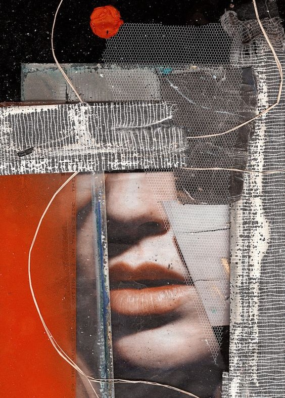

[](https://classroom.github.com/a/zprwltzm)
# Typography CSS library
**Author:** [*Štruncová Anna*](https://github.com/annastruncova)
## Demo site
Link to **[demo](https://pslib-cz.github.io/2023-l4-web-typographic-library-annastruncova/)** site for preview.
## Content
1. [Implemantation](#Implementation)
2. [Fonts](#Fonts)
3. [Colors](#Colors)
4. [Headings](#Headings)
5. [Text](#Text)
6. [Lists](#Lists)  
       6.1. [Ordered list](#Ordered-list)  
       6.2. [Unordered list](#Unordered-list)  
7. [Components](#Components)  
       7.1. [Tables](#Tables)
       7.2. [Picture](#Picture)  
       7.3. [Buttons](#Buttons)
## Implementation
1. Download [Fontify](CSS/typography.css)
2. Copy CSS file into your project
3. Link CSS file via stylesheet in your HTML files
```html
<link rel="stylesheet" href="./CSS/typography.css">
```
## Usage
Typographic library with CSS and HTML resources simplify web design, offering multiple components.
## Fonts
Fontify is using [Petrona](https://fonts.google.com/specimen/Petrona?query=Petrona) and [Lora](https://fonts.google.com/specimen/Lora?query=Lora)
## Color
This library uses predefined colors.
```css
:root {
    --key-color: #FF4B4B;
    --dark: #393939;
    --light: #E7D6C6;
    --background: #fff;
}
```
## Headings
You can use headings from `<h1>` to `<h5>`.

## Text
Document's font size is set to `16px`. There are multiple tags that you can further use to customize the text, such as `<u>`, `<b>`, `<s>`, `<mark>`, `<i>`, `<small>`, `<a>`.
## Lists
There are two types of predefined lists.
### Ordered list
You can create ordered list using the `<ol>` tag.
```html
<ol>
    <li>In a large bowl beat the egg yolks and sugar for about 2 minutes, set aside.</li>
    <li>Lorem ipsum, dolor sit amet consectetur adipisicing elit.</li>
    <li> Ipsum illum minima ea recusandae.
        <ol>
            <li>Add the egg yolk mixture back into the saucepan</li>
            <li> about 7 to 8 minutes making sure to stir the whole time.</li>
        </ol>
    </li>
    <li>Praesentium sint ad ut neque debitis consectetur architecto error molestiae porro ipsam?</li>
</ol>
```
### Unordered list
You can create unordered list using the `<ul>` tag.
```html
<ul>
    <li>Ingredients
        <ul>
            <li>7 Egg Yolks</li>
            <li>2/3 of a Cup of Granulated Sugar</li>
        </ul>
    </li>
    <li>Something</li>
</ul>
```
## Components
### Table 
Pre styled table that you can use for better visualization of data
syntax:
```html
<table class="table">
    <caption>What the table contains</caption>
    <thead>
        <tr>
            <td class="dark">&nbsp;</td>
            <th>1</th>
            <th>2</th>
            <th>3</th>
        </tr>
    </thead>
    <tbody>
        <tr>
            <th>a</th>
            <td>Domenic</td>
            <td>1</td>
            <td>3</td>
        </tr>
        <tr>
            <th>b</th>
            <td>Saily</td>
            <td>5</td>
            <td>4</td>
        </tr>
        <tr>
            <th>c</th>
            <td>Nick</td>
            <td>0</td>
            <td>1</td>
        </tr>
    </tbody>
</table>
```
### Picture
syntax:
```html
<div class="photo">
    <figure class="photo__block">
        <a href="./img/picture.jpg" class="image-link"></a>
        <figcaption class="photo-title">Caption photo</figcaption>
    </figure>
</div>
```
### Buttons
To create a button add `class="button"` to `<a>` tag. You can also use `button button-dark"` or `button button-light"`.
```html
<a class="button button-dark" type="button">Dark</a>
```
```html
<a class="button button-light" type="button">Light</a>
```